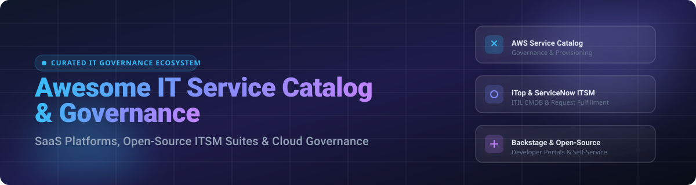

# 🛠️ Awesome IT Service Catalog & Governance 🏛️

  

  
  
  
  
  

---

## 📌 Top IT Service Catalog & Governance Ecosystem 🌐

**Curated List of Commercial SaaS Platforms & Open-Source GitHub Projects**  
*Focused on Service Catalog Management, ITIL Governance, Self-Hosted ITSM Platforms & Cloud Resource Catalogs*  

**Last updated: October 2026**

This repository tracks notable **commercial IT service catalog and governance platforms** and **open-source projects** that define, publish, and govern IT services — from cloud service catalogs to full ITIL-aligned service management suites.

---

## 📖 Table of Contents 📑

- [📊 SaaS & Hosted Enterprise Platforms](#-saas--hosted-enterprise-platforms)
- [🔓 Open-Source GitHub Projects](#-open-source-github-projects)
- [🤝 How to Contribute](#-how-to-contribute)
- [💖 Support & Sponsorship](#-support--sponsorship)
- [⚖️ Disclaimer](#-disclaimer)
- [⭐ Star History](#-star-history)

---

## 📊 SaaS & Hosted Enterprise Platforms

> 💡 **Market Size & Structure**: The global **IT Service Management (ITSM) and Service Catalog market** is estimated at **$10.5 Billion in 2026**, growing at a ~12.5% CAGR toward $16B+ by 2030. The enterprise sector is **moderately fragmented**, with ServiceNow holding dominant market share (~35–40%) in large enterprises, while mid-market and cloud-native governance niches are contested by strong platforms like Atlassian Jira Service Management, Freshservice, AWS Service Catalog, and BMC Helix.

| Platform | Description & Key Features | Company Size / Valuation | Starting Price | Free Tier / Trial Limits |
| :--- | :--- | :--- | :--- | :--- |
| **[AWS Service Catalog](https://aws.amazon.com/servicecatalog/)** | ☁️ **AWS's managed service catalog** — allows organizations to create and manage catalogs of approved IT services on AWS. **Portfolios, products, and constraints** provide governance and compliance. **Best for AWS-native service governance**. | **$169 Billion** annual revenue run rate (Amazon Web Services division) | **$0.0007** per API call (after free tier) | **1,000 API calls** per account, per region, per month free forever |
| **[ServiceNow ITSM](https://www.servicenow.com/)** | 💼 **The enterprise standard for IT service management** — comprehensive ITIL-aligned suite with service catalog, incident, problem, change, and CMDB. **Best for large enterprises with complex ITSM needs**. | **$138.9 Billion** market cap (~$13.28B annual revenue) | **~$70 - $200** per fulfiller/agent per month (custom enterprise quote) | **Personal Developer Instance (PDI)** free forever for developers; **30-day trial** for store apps |
| **[BMC Helix](https://www.bmc.com/)** | 🏢 **Enterprise ITSM suite** — AI-driven service management with comprehensive service catalog. **Best for large enterprises**. | **~$14 Billion - $15 Billion** private valuation (~$2B - $10B annual revenue) | **~$180 - $320** per named agent per month (custom enterprise quote) | **30-day proof-of-concept (POC)** trial system upon sales request |
| **[Jira Service Management](https://www.atlassian.com/software/jira/service-management)** | 🛠️ **Atlassian's ITSM platform** — service catalog, request management, and ITIL processes integrated with Jira. **Best for Atlassian ecosystem users**. | **$47 Billion** market cap (Atlassian; ~$4.8B annual revenue) | **$20** per agent per month (Standard plan) | **Free Plan for up to 3 agents** (2 GB storage, 500 automation runs/mo) |
| **[Freshservice](https://www.freshworks.com/freshservice/)** | 🚀 **Modern ITSM platform** — service catalog, incident management, and asset management with clean UI. **Best for SMBs and mid-market**. | **$3.3 Billion** market cap (Freshworks; ~$840M annual revenue) | **$19** per agent per month (Starter tier, billed annually) | **14-day free trial** with full platform access |
| **[ManageEngine ServiceDesk Plus](https://www.manageengine.com/)** | ⚙️ **ITSM platform** — service catalog, incident, change, and asset management. **Best for organizations wanting ManageEngine ecosystem**. | **~$1.33 Billion** parent revenue (Zoho Corp; ~$520M ManageEngine segment) | **$16** per technician per month (Standard cloud plan) | **Free Plan for up to 5 technicians** (Free Edition forever) |
| **[SolarWinds Service Desk](https://www.solarwinds.com/)** | 📈 **ITSM platform** — service catalog, incident management, and asset tracking. **Best for SolarWinds ecosystem users**. | **~$796.9 Million** annual revenue (acquired by Turn/River Capital) | **$39** per technician per month (billed annually) | **30-day free trial** fully functional |
| **[Ivanti Neurons](https://www.ivanti.com/)** | 🔐 **ITSM and endpoint management** — service catalog with automation and self-service. **Best for Ivanti ecosystem users**. | **~$500 Million** annual revenue (backed by Clearlake Capital) | Custom enterprise quote | **Demo-based trial** available upon request with sales representative |
| **[Cherwell](https://www.cherwell.com/)** | 📦 **ITSM and service management platform** — service catalog, CMDB, and ITIL processes. **Best for enterprise ITSM**. | **Subsidiary of Ivanti** (acquired by Ivanti in 2021) | **~$150 - $189** per month (legacy baseline) | **30-day trial / demo** on request via Ivanti |
| **[SysAid](https://www.sysaid.com/)** | 💻 **ITSM and service desk software** — service catalog, incident management, and self-service portal. **Best for organizations wanting integrated ITSM**. | **~$20 Million** annual revenue ($30M total funding raised) | **$89** per agent per month (Professional plan) | **14-day free trial** (no credit card required) |

---

## 🔓 Open-Source GitHub Projects

Below is a curated list of leading open-source IT service catalog, ITSM, CMDB, and internal developer portal repositories, **sorted by GitHub Stars_Counts (descending)**:

- **[Backstage](https://github.com/backstage/backstage)**   
  ⚙️ **CNCFR-hosted developer portal platform created by Spotify** — provides an open platform for building developer portals, internal service catalogs, software templates, and technical documentation. **Best for microservice catalog and internal developer platform (IDP) governance**.

- **[NetBox](https://github.com/netbox-community/netbox)**   
  🌐 **Infrastructure resource modeling & Source of Truth (NSoT)** — comprehensive IPAM, DCIM, and technical service catalog model for network and cloud infrastructure dependencies. **Best for network service catalog & CMDB source of truth**.

- **[GLPI](https://github.com/glpi-project/glpi)**   
  🖥️ **Free Asset and IT Management Software package**, GPL-3.0 licensed. **ITIL Service Desk, licenses tracking, and software auditing**. **Service catalog with self-service portal**. **The de facto open-source IT asset management platform** — used by thousands of organizations worldwide. **Best for integrated ITAM and service desk**.

- **[Zammad](https://github.com/zammad/zammad)**   
  📩 **Web-based open-source customer support / ticketing system**, AGPL-3.0 licensed. Offers SLA management, custom ticket categories, automated workflows, and self-service customer portal capabilities. **Best for modern open-source help desk and request catalog**.

- **[iTop](https://github.com/Combodo/iTop)**   
  📂 **Complete open-source ITIL web-based service management tool**, GPL-3.0 licensed with **314 years of estimated COCOMO effort** and active development since 2009. **Fully customizable CMDB, helpdesk, service catalog, and document management**. **Service Catalog Management** — organize and manage detailed service catalogs with clear structured information about available IT services. **User-friendly web portal** for simplified request declaration and tracking with service catalog submission. **ITIL-compatible change management** with differentiated workflows for minor, major, and other change types. **SLA tracking** with reports on resolution times, team performance, and service interruptions. **Best for comprehensive open-source ITSM with service catalog**.

- **[Znuny](https://github.com/znuny/znuny)**   
  🔄 **Fork of OTRS Community Edition**, open-source service management suite. Features customer service catalog management, category & item hierarchy, SLA escalations, and ITIL process management. **Best for OTRS-compatible open-source service catalog**.

- **[OTOBO](https://github.com/otobo/otobo)**   
  🎯 **Modern open-source ITSM and ticket system** — flexible customer service portal, ITIL process management, customizable service catalog, and CMDB integration. **Best for community-driven enterprise service desk**.

- **[CMDBuild READY2USE](https://github.com/cmdbuild/cmdbuild)**   
  🏗️ **ITIL-aligned IT service management solution built on CMDBuild**, open-source. **Service Catalogue Management** — define IT services available to users with request and support modalities, availability, SLA, and KPI. **Business and Technical Catalogue** structured in multi-level categories and request types. **Request Fulfilment workflow** manages standard (from Catalogue) and non-standard service requests. **Dependency analysis** among services and configuration items for fault impact analysis. **Reconciliation with Active Directory, OCS Inventory, Microsoft SCCM, VMware vCenter, and AWS**. **Deployed at Camera dei Deputati (Italian Chamber of Deputies)** for IT service catalog management. **Best for ITIL-aligned service catalog with CMDB**.

- **[Heidsoft ITSM](https://github.com/heidsoft/itsm)**   
  🤖 **AI-native enterprise IT service management platform**, Apache-2.0 licensed. **Aims to provide ServiceNow-class core ITSM capabilities** while remaining lightweight, private-deployment friendly, and extensible. **Covers tickets, incidents, problems, changes, releases, service requests, service catalogs, knowledge, SLA, CMDB, and BPMN orchestration**. **AI embedded into triage, summarization, knowledge retrieval, workflow recommendations, audit trails, and controlled tool execution**. **RBAC, tenant isolation, MSP foundations, and organization management**. **Best for AI-native ITSM with ServiceNow-class ambitions**.

- **[FreeITSM](https://github.com/edmozley/freeitsm)**   
  ✨ **Full service desk and ITSM platform**, open-source with **1.0.0 released September 2026**. **Tickets with self-service portal, email integration, SLAs, and knowledge base**. **Assets, software, contracts, and CMDB with dependency mapping**. **Change and problem management plus a war room for major incidents**. **Tasks, forms, workflows, calendar, and learning management system**. **Service status pages, morning checks, Watchtower, and reporting**. **Single sign-on (OIDC), LDAP, Active Directory, and REST API**. **25 languages supported**. **Docker images for x86-64 and ARM (Raspberry Pi, Apple Silicon)**. **Best for modern open-source ITSM with broad capabilities**.

- **[OTRS Community Repository](https://github.com/OTRS/otrs)**   
  📜 **Open-source service management platform with Customer Service Catalogue**. **Category and Item Management** — add categories to group items and items to the catalogue. **Sub-category support** with Parent Category::Child Category display. **Best for customizable service catalog management**.

---

### 🧱 Frameworks & Specialized Tools for Custom Service Governance

- **Imbi** — Open-source service catalog with graph database (Apache AGE) and analytics (ClickHouse), inbound event processing from GitHub and PagerDuty, OAuth2/OIDC authentication, and Docker Compose deployment.
- **Elements Catalyst** — Jira Service Management app for service catalog visibility, cost tracking, and usage analytics.
- **FusionDirectory** — Open-source IAM with service management capabilities including DNS, DHCP, and workflow engine with email tasks.
- **Alibaba Cloud Service Catalog** — Terraform-based service catalog with governance constraints, product and portfolio management, and centralized compliance settings.

> 💡 **Architectural Note**: Combine **iTop** for comprehensive ITIL-aligned service management with customizable CMDB and service catalog. Use **CMDBuild READY2USE** for ITIL-aligned service catalog with business and technical catalog structure and request fulfilment workflows. Deploy **FreeITSM** for a modern full-featured ITSM platform with CMDB dependency mapping. Choose **GLPI** for integrated IT asset management and ITIL service desk. Integrate **Znuny / OTOBO** for customizable customer service catalog with category and item management. Use **Heidsoft ITSM** for AI-native enterprise service management targeting ServiceNow-class capabilities. Note that true enterprise IT service catalog governance with managed infrastructure, global scale, and vendor-supported SLAs (ServiceNow, AWS Service Catalog, BMC Helix) remains primarily commercial territory; open-source stacks provide strong ITIL service management, service catalog, and CMDB foundations.

---

## 🤝 How to Contribute

1. 🍴 Fork the repository.
2. 📝 Add or edit entries in `README.md` (following the existing table or list formats).
3. 📌 Include: Name, website/GitHub link, clear description, pricing/licensing details, and primary use case.
4. 🔀 Submit a Pull Request with a clear title and description.

Check out [Awesome-Awesome-Awesome](https://github.com/ishandutta2007/Awesome-Awesome-Awesome) for more curated lists!

---

## 💖 Support & Sponsorship

Thank you for exploring and using this curated IT Service Catalog & Governance ecosystem guide! If you find this list helpful for your ITIL transformations, cloud architecture, or self-hosted ITSM evaluation, please consider supporting the project:

- ⭐ **Star this repository** on GitHub to increase visibility.
- 🔀 **Fork & Share** it with your ITSM teams, DevOps engineers, and IT leaders.
- ☕ **Buy me a coffee / Sponsor**: If you'd like to support ongoing updates and maintenance of this list, check out the [GitHub Sponsor Dashboard](https://github.com/sponsors/ishandutta2007).

Your support keeps this guide fresh, objective, and community-driven!

---

## ⚖️ Disclaimer

- This is a **community-curated** list — not exhaustive and not an official vendor endorsement.
- IT service catalog and governance platforms handle sensitive operational, configuration (CMDB), and asset data. Self-hosted solutions require proper security hardening, access controls, and compliance with data privacy regulations.
- **Service catalog design is a critical upfront task** — validate concepts on a clean system before migrating production service structures.
- **License considerations**: iTop uses GPL-3.0, GLPI uses GPL-3.0, FreeITSM is open-source, Heidsoft ITSM uses Apache-2.0, Zammad uses AGPL-3.0, Backstage uses Apache-2.0, and CMDBuild is open-source. Verify licensing against your organization's legal policies before committing.

---

## 📈 Star History

---

  <b>Made with ❤️ for IT service managers, ITSM practitioners, and organizations seeking service catalog governance sovereignty.</b> 
  <i>Let's make IT service catalog and governance more open, transparent, and ITIL-aligned.</i>

